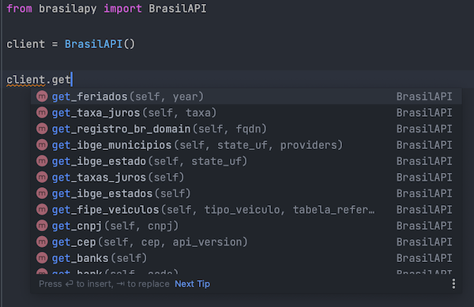

 

# BrasilApy
Um cliente da [Brasil  API](https://brasilapi.com.br/) em python3. Link do [repositório](https://github.com/BrasilAPI/BrasilAPI) oficial.

Nesta versão `1.0.0` esse cliente possui suporte a autocomplete por meio de Typed Hints. Todos as respostas são traduzidas para objetos do Pydantic, que trazem previsibilidade ao explorar a API  através da sua IDE favorita.



## Instalação
Rode o comando `pip install brasilapy` e estará tudo pronto.
A versão do python que é compativel com essa biblioteca é a `3.10+`.

## Documentação
Documentação oficial da API com todas as chamadas poderão se encontradas [neste link](https://brasilapi.com.br/docs).

### Código de exemplo
Para efetuar as consultas na API, basta instanciar a classe e fazer as consultas.

```py
from brasilapy import BrasilAPI

client = BrasilAPI()
estado = client.get_ibge_estado(state_uf="pb")

print(estado.id)
print(estado.regiao)
print(estado.sigla)

###
# para um caso mais complexo, temos
###
from brasilapy.constants import IBGEProvider

municipios = client.get_ibge_municipios(state_uf="pb", providers=(IBGEProvider.DADOS_ABERTOS_BR,))

for municipio in municipios:
    print(municipio.nome)
    print(municipio.codigo_ibge)
```

### Métodos disponíveis do `BrasilAPI`

| Método                                                                    | Detalhes |
|---------------------------------------------------------------------------|----------|
 | get_banks()                                                               |          |
 | get_bank(code: str)                                                       |          |
 | get_cep(cep: str, api_version: APIVersion)                                |          |
 | get_cnpj(cnpj: str)                                                       |          |
 | get_ddd(ddd: str)                                                         |          |
 | get_feriados(year: int)                                                   |          |
 | get_fipe_veiculos(tipo_veiculos: FipeTipoVeiculo, tabela_referencia: int) |          |
 | get_fipe_precos(codigo_fipe: str, tabela_referencia: int)                 |          |
 | get_fipe_tabelas()                                                        |          |
 | get_ibge_municipios(state_uf: str, providers: tuple\[IBGEProvider\]       |          |
 | get_ibge_estados()                                                        |          |
 | get_registro_br_domain(fqdn: str)                                         |          |
 | get_taxas_juros()                                                         |          |
 | get_taxa_juros(taxa: TaxaJurosType)                                       |          |

Os tipos de dados `APIVersion`, `FipeTipoVeiculo`, `IBGEProvider` e `TaxaJurosType` são classes de constants que podem ser importadas através do seguinte comando:

```py
from brasilapy.constants import APIVersion, FipeTipoVeiculo, IBGEProvider, TaxaJurosType
```

## Autores

<table>
<tbody>
<tr>
    <td style="text-align: center">
        
        <a href="https://github.com/lipe14-ops" target="_blank">Filipe Soares</a>
    </td>
    <td style="text-align: center">
        
        <a href="https://joepreludian.github.io" target="_blank">Jonhnatha Trigueiro</a>
    </td>
</tr>
</tbody>
</table>
